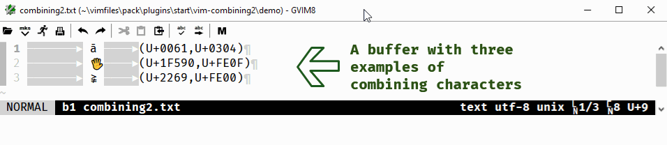
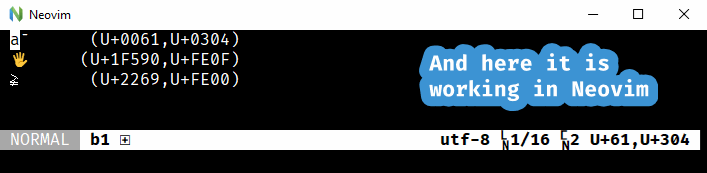
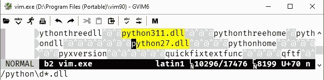

= vim-combining2
:author: Peter Kenny
:doctype: article
:icons: font
:pdf-theme: D:\git.kennypete\asciidoc\adoc\pdf\README-theme.yml
:sectnums:
//experimental is needed for kbd:[], which is NOT experimental 
:experimental:
:toc:
//there's no need for a toc title in GitHub/HTML, but in PDF there is
ifndef::backend-html5,env-github[:toc-title: Contents]
ifdef::backend-html5,env-github[:toc-title:]
//only two levels of toc make sense in a PDF
ifndef::backend-html5,env-github[:toclevels: 2]
ifdef::backend-html5,env-github[:toclevels: 3]
//admonitions are unsatisfying on GitHub: they are not prominent and
//are too small. There seems to be no solution to that?
ifdef::env-github[]
:important-caption: :heavy_exclamation_mark:
:tip-caption: :bulb:
:note-caption: :information_source:
:caution-caption: :fire:
:warning-caption: :warning:
:white-check-mark: :white_check_mark:
endif::env-github[]

== Combining Characters

Combining characters are used for all manner of things.
Three examples:

1. Adding an accent to a character, e.g., ā (U+0061,U+0304)
2. Enabling character variations, e.g., 🖐 versus 🖐️ (U+1F590,U+FE0F)
3. HTML5 two code point characters: e.g., ≩︀ (_aka_ \&gvertneqq; U+2269,U+FE00)

In Unicode 15, there are 2,450 combining characters categorised as
M&#x7b;char&#x7d;.
Refer:
https://www.unicode.org/Public/UCD/latest/ucd/UnicodeData.txt[UnicodeData.txt].

An example (noting the &#x201C;Mn&#x201D; ― Mark, Nonspacing):

....
0300;COMBINING GRAVE ACCENT;Mn;230;NSM;;;;;N;NON-SPACING GRAVE;;;;
....

Some Unicode https://www.unicode.org/Public/UCD/latest/ucd/Blocks.txt[blocks]
have descriptions of &#x201C;Combining&#x2026;&#x201D;.
Examples are
&#x201C;0300..036F; Combining Diacritical Marks&#x201C; and
&#x201C;FE20..FE2F; Combining Half Marks&#x201D;.
However, there are many other combining characters outside of those blocks.
For example, U+0483 to U+0486 are combining Cyrillic characters.
Further, all the variation selectors, which are used for varying the
visual presentation of characters, such as the emoji example (#2), above,
are category Mn (Mark, Nonspacing).

== Searching for &#x2F; Substituting Combining Characters

One challenge with Vim is that when _using classes_ you can neither search for
nor substitute characters that are combined with combining characters.

For example, suppose you have the word &#x201C;Māori&#x201D;, where the ā is
U+0061,U+0304.
Some searches or substitutions will work, e.g., literals like:

ifdef::env-github[[source,vim]]
ifndef::env-github[[source,vimscript]]
----
/\va%u304
----

or

ifdef::env-github[[source,vim]]
ifndef::env-github[[source,vimscript]]
----
/\v(a|e|i|o|u)[\u300-\u36F]
----

However, the following will not find the character with the combining
character U+0304:

ifdef::env-github[[source,vim]]
ifndef::env-github[[source,vimscript]]
----
/\v[a]%u304
----

or

ifdef::env-github[[source,vim]]
ifndef::env-github[[source,vimscript]]
----
/\v.[\u300-\u36F]
----

[CAUTION]
====
I raised https://github.com/vim/vim/issues/12361[issue 12361], which was not
considered a bug, though there was one comment at least partially in support:

> I would also think it's a bug, at least [e][&#x5C;u0305] should work the
same as e[&#x5C;u305] I think.

With the issue going quiet &#x2F; nowhere, I decided to find my own
&#x201C;solution&#x201D; &#x2015; or, probably more accurately/fairly,
workaround &#x2015; to it.
====

== So, "What&#x2019;s the problem?"

Two simple examples illustrate some of the challenges caused by the current
way search and substitution work.

First, a searching scenario:

ifdef::env-github[[source,vim]]
ifndef::env-github[[source,vimscript]]
----
/a.
----

This will find words such as &#x201C;an&#x201D; and &#x201C;at&#x201D;.

However, it will also find:

* ā (a with macron, U+0061,U+0304)
* á (a with acute, U+0061,U+0301)

That _may_ not be what you want because humans read those characters
as one glyph, so one or both _characters_ may be found (or substituted)
unintentionally.  (And it is, in part, why some precomposed characters like á,
i.e., U+00E1, exist.  Precomposed characters like that provide a one-code
point character, and, as the following shows, it is a combined
U+0061,U+0301 - "0061 0301").

....
00E1;LATIN SMALL LETTER A WITH ACUTE;Ll;0;L;0061 0301;;;;N;LATIN SMALL LETTER A ACUTE;;00C1;;00C1
....

Second, performing some types of substitutions is impossible.
Take a scenario such as where you want to substitute all characters of a class
where each character has a particular variation selector to another variation
selector (or remove the selector altogeher).
You cannot use `.[\uFE0F]` to do so; you would have to use an _or_ with all
of the characters you wanted to find.

So, for example, with dozens of emoji where the variation selector 16 (U+FE0F)
has been used, you would have to list them all out in a big _or_ search
pattern.
That obviously would be inefficent, annoying, and impractical.
It would require something like this:

ifdef::env-github[[source,vim]]
ifndef::env-github[[source,vimscript]]
----
/\v(☹|🖐)[\uFE0F]
----

&#x2026; to find ☹️ and 🖐️.

A solution/workaround for this is to pre-process the combining characters.
Once substituted with decimal character references, hexadecimal character
references, or Python Unicode references, searches and substitutions may
then be constructed using classes of characters.

For example, using the example
`&#x2F;&#x5C;v.&#x5B;&#x5C;u300-&#x5C;u36F&#x5D;`, once all combining
characters are substituted with hexadecimal character references, finding
all characters that use them is straightforward:

ifdef::env-github[[source,vim]]
ifndef::env-github[[source,vimscript]]
----
/\v\c.\&#x3[0-6][0-6a-f];
----

Similarly, now `☹\&#xFE0F;`, `🖐\&#xFE0F;`, `a\&#x305;`, etc., may be found
with a search like:

ifdef::env-github[[source,vim]]
ifndef::env-github[[source,vimscript]]
----
/\v.\&#x[[:alnum:]]+;
----

== What this plugin does

This plugin provides a means of substituting all M&#x7B;char&#x7D;
category characters with either a
decimal character reference (`'&#' [0-9]+ ';'`),
hexadecimal character reference `('&#x' [0-9A-F]+ ';')`,
or a Python Unicode character (`"\u" [0-9a-z]{4}` _or, where necessary_
`"\U" [0-9a-z]{8}`).

Three commands have been created to do this:

* #C2d# &#x2015; Combining to decimal
* #C2h# &#x2015; Combining to hexadecimal
* #C2p# &#x2015; Combining to Python

The demonstrations of C2h and C2d, which follow, show two of these commands
in action.
The input buffer is left as-is, with a new buffer created alongside it for
the user to determine whether they want to use it or otherwise discard it.

== Demonstrations

#C2h# using gvim (my preferred Vim flavour 😎️):

ifdef::env-github,backend-html5[]

endif::env-github,backend-html5[]

ifndef::env-github,backend-html5[https://github.com/kennypete/vim-combining2/blob/main/demo/vim-combining2.gif[Demonstration of C2h in gvim]]

And to show it works in Neovim too, #C2d#:

ifdef::env-github,backend-html5[]

endif::env-github,backend-html5[]

ifndef::env-github,backend-html5[https://github.com/kennypete/vim-combining2/blob/main/demo/nvim-combining2.gif[Demonstration of C2h in Neovim]]

== How it works

Although it is possible to substitute combining characters with a reverse loop
using Vimscript, I decided to use the Python Unicode Character Database (UCD)
module,
https://docs.python.org/3/library/unicodedata.html#unicodedata.unidata_version[unicodedata]
in this plugin.  That was as much for my own learning, i.e., to see how to
use Python &#x201C;within&#x201D; Vim, which I had done very little of before.

=== The combining2.vim

Consequently, the only vimscript is combining2.vim, which has just four lines:

ifdef::env-github[[source,vim]]
ifndef::env-github[[source,vimscript]]
----
let s:path = substitute(expand('<sfile>:p:h'), '\\', '/', 'g')
command! C2d silent execute ":py3file " .. s:path .. "/combining2dec.py"
command! C2h silent execute ":py3file " .. s:path .. "/combining2hex.py"
command! C2p silent execute ":py3file " .. s:path .. "/combining2py.py"
----

1. The first line determines the path to the script, which is where the Python
scripts are similarly located.
2. The `command!` lines define the three commands, which, when used,
execute, using `py3file`, the applicable Python script on the contents of the
current buffer.

=== The Python Scripts

The code in the `.py` files has a few comments, though with only a dozen
substantive lines of code (in, e.g., combining2hex.py) not much explanation
is necessary.
Key points are:

. `import unicodedata, vim` is used to import the required modules
. A `result` variable is created
. The lines in the current buffer are looped through
.. Initialise the `sline` variable (it's used to store the replacement line)
.. Where a character is in category Mc, Me, or Mn, it is replaced with
the applicable decimal, hexadecimal, or Python reference, and added to `sline`
.. Other non-M? characters are passed to `sline` as-is
.. At the end of each line, add a NewLine character to `sline`
.. Add `sline` to `result`
. Add the `result` to the &#x2A; register
. Split the window, create a new buffer, and put the &#x2A; register into it.

== Installation

=== Using the in-built Vim package management

Refer Vim&#x2019;s in-built
https://vimhelp.org/repeat.txt.html#pack-add[package management].
This example example presumes you are in your ~\vimfiles\pack\plugins\start
directory (so using Windows) so, adjust it accordingly if you are using a Linux
distro, create any necessary directories, etc.:

[source,powershell]
----
git clone https://github.com/kennypete/vim-combining2 vim-combining2
----

Alternatively, download the .zip from
https://github.com/kennypete/vim-combining2
and unzip the contents within the folder vim-combining2-main to
`~\vimfiles\pack\plugins\start\vim-combining2`.

=== Using a plugin manager

If you use a plugin manager, you probably already know how to use it.
Nonetheless, here are simple steps explaining how to do so with
https://github.com/junegunn/vim-plug[vim-plug]
(using &#x201C;shorthand notation&#x201D;):

* In the vim-plug section of your `_vimrc`, add
`Plug 'kennypete/vim-combining2'` between `call plug#begin()` and
`call plug#end()`.
* Reload your `_vimrc` and `:PlugInstall` to install plugins, which should
install `vim-combining2`.

=== Running the Python Scripts Independently

You don&#x2019;t need to install a plugin.  If you want to only use one or more
of the Python scripts, just download it&#x2F;them and run them from Vim with
`py3file`, e.g.:

ifdef::env-github[[source,vim]]
ifndef::env-github[[source,vimscript]]
----
:py3file {path}combining2hex.py
----

== Python 3

You also need Python 3 installed, of course.  For example, if you are using
the latest gvim (at the time of writing version 9.0 with patch 1677) then
you will need Python 3.11.
As explained at
https://vimhelp.org/if%5Fpyth.txt.html#python-dynamic[python-dynamic]:

====
The name of the DLL should match the Python version Vim was compiled with.
… For Python 3 … edit "gvim.exe" and search for "python\d*.dll\c".
====

[NOTE]
====
This is _literal_. So, for example, drag the vim.exe into a gvim window and
then execute the search.
It will find *python311.dll* (or whatever the version the vim.exe was compiled
with).

_Neovim&#x2019;s requirements are different.  As I don&#x2019;t use it, other_
_than when testing whether things also work with it, all I will say is that_
_I had to read the Neovim documentation and run_
`.\python.exe -m pip install --user --upgrade pynvim` _from my Python 3.11_
_installation directory from PowerShell._
====

// vim:tw=78
